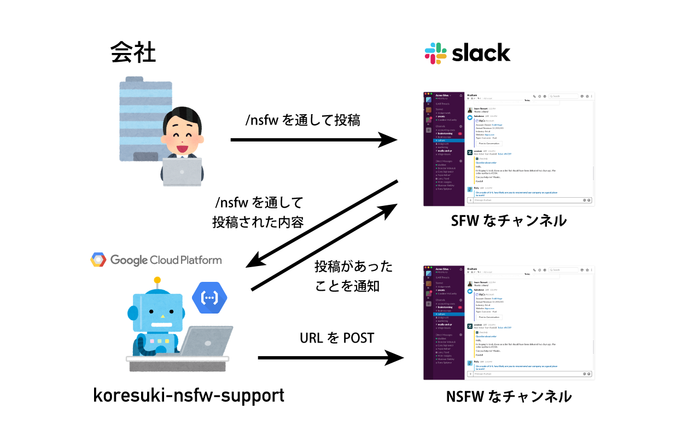

# Koresuki NSFW Support

## About

Slack に NSFW な URL を投稿したいときに NSFW なチャンネルを開かずとも、 Slash コマンド `/nsfw` を通して Twitter の URL を送信すれば NSFW なチャンネルに投稿して、 SFW のチャンネルに通知してくれるやつ。

## Architecture

* 動作には Google Could Functions を使います
* Slack 側にアプリ登録が必要です

## License

* [MIT License](LICENSE)

## Author

* windyakin ([@MITLicense](https://twitter.com/MITLicense))
